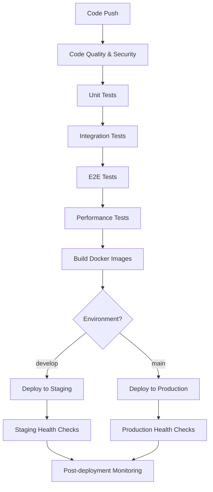

# 🚀 Ntsamaela CI/CD & Deployment Guide

## 📋 Table of Contents

1. [Overview](#overview)
2. [CI/CD Pipeline Architecture](#cicd-pipeline-architecture)
3. [Automated Testing in CI](#automated-testing-in-ci)
4. [Staging Environment Deployment](#staging-environment-deployment)
5. [Production Deployment Process](#production-deployment-process)
6. [Database Migration Automation](#database-migration-automation)
7. [Rollback Procedures](#rollback-procedures)
8. [Monitoring and Health Checks](#monitoring-and-health-checks)
9. [Deployment Scripts](#deployment-scripts)
10. [Troubleshooting](#troubleshooting)

---

## 🎯 Overview

The Ntsamaela CI/CD pipeline provides a comprehensive, automated deployment process that ensures code quality, security, and reliability across all environments. The pipeline includes automated testing, staging deployment, production deployment with approval gates, and automated rollback capabilities.

### Key Features

- **Automated Testing**: Unit, integration, E2E, and performance tests
- **Multi-Environment Support**: Development, staging, and production
- **Database Migration Automation**: Safe migrations with rollback capabilities
- **Health Monitoring**: Comprehensive health checks and monitoring
- **Rollback Procedures**: Automated and manual rollback capabilities
- **Security Scanning**: Code quality and security checks

---

## 🔄 CI/CD Pipeline Architecture

### Pipeline Stages



### Pipeline Triggers

- **Push to `develop`**: Triggers staging deployment
- **Push to `main`**: Triggers production deployment
- **Pull Request**: Runs tests and quality checks
- **Manual Trigger**: Available for emergency deployments

---

## 🧪 Automated Testing in CI

### Test Categories

1. **Code Quality & Security**
   - ESLint and Prettier checks
   - TypeScript compilation
   - Security audit
   - CodeQL analysis

2. **Unit Tests**
   - 90%+ code coverage requirement
   - Fast execution (< 5 minutes)
   - Isolated test environment

3. **Integration Tests**
   - API endpoint testing
   - Database integration
   - External service mocking

4. **E2E Tests**
   - Complete user journey testing
   - Cross-browser compatibility
   - Mobile app testing

5. **Performance Tests**
   - Load testing
   - Response time validation
   - Memory usage monitoring

### Test Execution

```bash
# Run all tests locally
npm run test

# Run specific test categories
npm run test:unit
npm run test:integration
npm run test:e2e
npm run test:performance
npm run test:smoke

# Run tests with coverage
npm run test:coverage
```

### Test Configuration

- **Jest**: Test runner and framework
- **Supertest**: API testing
- **Testing Library**: Component testing
- **Playwright**: E2E testing
- **Artillery**: Performance testing

---

## 🧪 Staging Environment Deployment

### Staging Environment

- **URL**: https://staging.ntsamaela.com
- **API URL**: https://api-staging.ntsamaela.com
- **Database**: Single-AZ RDS instance
- **ECS**: Single task per service
- **Resources**: Reduced for cost optimization

### Staging Deployment Process

1. **Automatic Trigger**
   - Push to `develop` branch
   - All tests must pass
   - Code quality checks pass

2. **Deployment Steps**
   ```bash
   # Build and push images
   docker build -t ntsamaela-api:latest -f apps/api/Dockerfile .
   docker push $ECR_REGISTRY/ntsamaela-api:latest
   
   # Deploy to staging
   aws ecs update-service --cluster ntsamaela-staging-cluster --service ntsamaela-api-staging --force-new-deployment
   
   # Run migrations
   aws ecs run-task --cluster ntsamaela-staging-cluster --task-definition ntsamaela-migration-staging
   
   # Health checks
   curl -f https://api-staging.ntsamaela.com/health
   ```

3. **Staging Validation**
   - Smoke tests
   - API functionality tests
   - Performance baseline tests
   - Security scans

### Staging Health Checks

```bash
# Check staging health
./scripts/health-check.sh --environment staging --type all

# Run smoke tests
npm run test:smoke -- --base-url=https://staging.ntsamaela.com
```

---

## 🚀 Production Deployment Process

### Production Environment

- **URL**: https://ntsamaela.com
- **API URL**: https://api.ntsamaela.com
- **Admin URL**: https://admin.ntsamaela.com
- **Database**: Multi-AZ RDS instance
- **ECS**: Auto-scaling (2-10 tasks)
- **Resources**: Full production resources

### Production Deployment Process

1. **Pre-deployment Checklist**
   - [ ] All tests passing
   - [ ] Code review approved
   - [ ] Staging deployment successful
   - [ ] Database backup created
   - [ ] Rollback plan prepared

2. **Deployment Steps**
   ```bash
   # Create backup
   aws rds create-db-snapshot --db-instance-identifier ntsamaela-db --db-snapshot-identifier ntsamaela-pre-deploy-$(date +%Y%m%d-%H%M%S)
   
   # Deploy to production
   aws ecs update-service --cluster ntsamaela-cluster --service ntsamaela-api --force-new-deployment
   
   # Run migrations
   aws ecs run-task --cluster ntsamaela-cluster --task-definition ntsamaela-migration-prod
   
   # Health checks
   curl -f https://api.ntsamaela.com/health
   ```

3. **Post-deployment Validation**
   - Comprehensive health checks
   - Performance monitoring
   - Error rate monitoring
   - User acceptance testing

### Production Health Checks

```bash
# Check production health
./scripts/health-check.sh --environment production --type all

# Run smoke tests
npm run test:smoke -- --base-url=https://ntsamaela.com

# Monitor deployment
aws ecs wait services-stable --cluster ntsamaela-cluster --services ntsamaela-api ntsamaela-web
```

---

## 🗄️ Database Migration Automation

### Migration Process

1. **Pre-migration Safety Checks**
   - Database health validation
   - Active connection monitoring
   - Backup creation
   - Migration dry-run

2. **Migration Execution**
   ```bash
   # Dry run migration
   ./scripts/migrate.sh --environment production --dry-run
   
   # Execute migration
   ./scripts/migrate.sh --environment production
   
   # Validate migration
   ./scripts/migrate.sh --environment production --validate
   ```

3. **Post-migration Validation**
   - Schema validation
   - Data integrity checks
   - Performance verification
   - Rollback capability test

### Migration Safety Features

- **Automatic Backups**: Pre-migration snapshots
- **Rollback Capability**: Automatic rollback on failure
- **Health Checks**: Database health validation
- **Timeout Protection**: 5-minute migration timeout
- **Validation**: Schema version verification

### Migration Monitoring

```bash
# Monitor migration progress
aws logs tail /aws/ecs/ntsamaela/migration --follow

# Check migration status
aws ecs describe-tasks --cluster ntsamaela-cluster --tasks <task-arn>
```

---

## 🔄 Rollback Procedures

### Automatic Rollback

The system automatically triggers rollback in the following scenarios:

- Health check failures
- High error rates (>5%)
- Performance degradation
- Database connection issues

### Manual Rollback

```bash
# Rollback ECS services
./scripts/rollback.sh --environment production --previous-task-def <task-def-arn>

# Rollback database
./scripts/rollback.sh --environment production --snapshot-id <snapshot-id>

# Rollback specific service
./scripts/rollback.sh --environment production --service api
```

### Rollback Scenarios

1. **ECS Service Rollback**
   - Revert to previous task definition
   - Update service configuration
   - Verify service health

2. **Database Rollback**
   - Restore from RDS snapshot
   - Update connection strings
   - Validate data integrity

3. **Infrastructure Rollback**
   - Revert Terraform changes
   - Update DNS records
   - Restore configurations

### Rollback Validation

```bash
# Verify rollback success
curl -f https://api.ntsamaela.com/health
curl -f https://ntsamaela.com

# Check service status
aws ecs describe-services --cluster ntsamaela-cluster --services ntsamaela-api
```

---

## 📊 Monitoring and Health Checks

### Health Check Endpoints

- **API Health**: `GET /health`
- **Web Health**: `GET /`
- **Database Health**: `GET /health/db`
- **Redis Health**: `GET /health/redis`
- **Comprehensive Health**: `GET /health/all`

### Monitoring Dashboards

1. **CloudWatch Dashboard**
   - ECS service metrics
   - RDS performance
   - ALB metrics
   - Redis metrics

2. **Application Metrics**
   - Response times
   - Error rates
   - Throughput
   - User activity

### Alerting

- **Critical Alerts**: Email + SMS
- **Warning Alerts**: Email only
- **Info Alerts**: Slack notifications

### Health Check Commands

```bash
# Check API health
curl -f https://api.ntsamaela.com/health

# Check database health
curl -f https://api.ntsamaela.com/health/db

# Check Redis health
curl -f https://api.ntsamaela.com/health/redis

# Check overall system health
curl -f https://api.ntsamaela.com/health/all
```

---

## 🛠️ Deployment Scripts

### Main Deployment Script

```bash
# Deploy to production
./scripts/deploy.sh --environment production --domain ntsamaela.com

# Deploy to staging
./scripts/deploy.sh --environment staging --domain staging.ntsamaela.com

# Skip infrastructure deployment
./scripts/deploy.sh --skip-infrastructure

# Skip database migrations
./scripts/deploy.sh --skip-migrations
```

### Health Check Script

```bash
# Check all health endpoints
./scripts/health-check.sh --environment production --type all

# Check only HTTP endpoints
./scripts/health-check.sh --environment production --type http

# Check only database
./scripts/health-check.sh --environment production --type database

# Check only ECS services
./scripts/health-check.sh --environment production --type ecs

# Check SSL certificates
./scripts/health-check.sh --environment production --type ssl --domain ntsamaela.com
```

### Migration Script

```bash
# Dry run migration
./scripts/migrate.sh --environment production --dry-run

# Execute migration
./scripts/migrate.sh --environment production

# Skip backup creation
./scripts/migrate.sh --environment production --skip-backup

# Force migration without confirmation
./scripts/migrate.sh --environment production --force
```

### Rollback Script

```bash
# Rollback ECS services
./scripts/rollback.sh --environment production --previous-task-def <task-def-arn>

# Rollback database
./scripts/rollback.sh --environment production --snapshot-id <snapshot-id>

# Rollback specific service
./scripts/rollback.sh --environment production --service api
```

---

## 🔧 Troubleshooting

### Common Issues

1. **ECS Service Not Starting**
   ```bash
   # Check service events
   aws ecs describe-services --cluster ntsamaela-cluster --services ntsamaela-api
   
   # Check task logs
   aws logs tail /aws/ecs/ntsamaela/application --follow
   ```

2. **Database Connection Issues**
   ```bash
   # Check database status
   aws rds describe-db-instances --db-instance-identifier ntsamaela-db
   
   # Check security groups
   aws ec2 describe-security-groups --group-ids sg-xxxxx
   ```

3. **Load Balancer Issues**
   ```bash
   # Check target health
   aws elbv2 describe-target-health --target-group-arn <target-group-arn>
   
   # Check ALB status
   aws elbv2 describe-load-balancers --names ntsamaela-alb
   ```

4. **SSL Certificate Issues**
   ```bash
   # Check certificate status
   aws acm describe-certificate --certificate-arn <cert-arn>
   
   # Check DNS validation
   aws route53 get-change --id <change-id>
   ```

### Debug Commands

```bash
# Check ECS cluster status
aws ecs describe-clusters --clusters ntsamaela-cluster

# Check running tasks
aws ecs list-tasks --cluster ntsamaela-cluster

# Check task definition
aws ecs describe-task-definition --task-definition ntsamaela-api

# Check CloudWatch logs
aws logs describe-log-groups --log-group-name-prefix /aws/ecs/ntsamaela
```

---

## 📚 Additional Resources

### Documentation

- [Deployment Runbook](DEPLOYMENT_RUNBOOK.md)
- [Infrastructure Guide](infrastructure/README.md)
- [API Documentation](docs/api.md)
- [Database Schema](docs/database.md)

### Tools and Scripts

- [Deployment Script](scripts/deploy.sh)
- [Rollback Script](scripts/rollback.sh)
- [Migration Script](scripts/migrate.sh)
- [Health Check Script](scripts/health-check.sh)

### Monitoring Tools

- [CloudWatch Dashboard](https://console.aws.amazon.com/cloudwatch/home)
- [ECS Console](https://console.aws.amazon.com/ecs/home)
- [RDS Console](https://console.aws.amazon.com/rds/home)
- [Route53 Console](https://console.aws.amazon.com/route53/home)

---

## 📝 Change Log

| Version | Date | Changes |
|---------|------|---------|
| 1.0.0 | 2024-01-01 | Initial CI/CD pipeline |
| 1.1.0 | 2024-01-15 | Added automated testing |
| 1.2.0 | 2024-02-01 | Added staging environment |
| 1.3.0 | 2024-02-15 | Added rollback procedures |
| 1.4.0 | 2024-03-01 | Added migration automation |

---

**🎯 This guide is a living document. Please update it as procedures change and new scenarios are discovered.**
